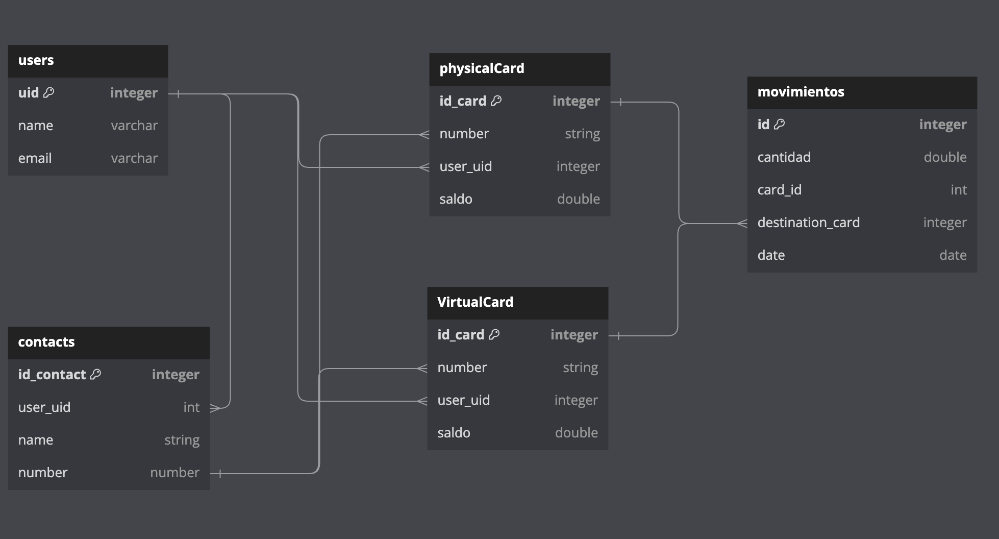

# 
SnapPay Bank

## Index

- <a href="#description" style="color: lightgreen;">Description</a>
  - <a href="#objective" style="color: lightgreen;">Objective</a>
  - <a href="#mvp-scope" style="color: lightgreen;">MVP scope</a>
- <a href="#project-requirements" style="color: lightgreen;">Project requirements</a>
  - <a href="#functional-requirements" style="color: lightgreen;">Functional requirements</a>
  - <a href="#no-functional-requirements" style="color: lightgreen;">No functional requirements</a>
- <a href="#user-interface-design" style="color: lightgreen;">User Interface Design</a>
- <a href="#database-design" style="color: lightgreen;">Database Design</a>
- <a href="#how-to-install-and-run-the-project" style="color: lightgreen;">How to Install and Run the Project</a>
- <a href="#how-to-use-the-project" style="color: lightgreen;">How to Use the Project</a>
- <a href="#credits" style="color: lightgreen;">Credits</a>
- <a href="#badges" style="color: lightgreen;">Badges</a>

## Description

SnapPay Mobile Bank is an easy-to-use app, with just a few taps, you can handle everything from checking your account history to transferring money and finding the nearest ATMs. Simplify your finances and stay in control, all from the palm of your hand.

### Objective

The objective of the application is to provide users with a convenient and secure way to manage their finances from their mobile devices, allowing them to perform basic banking operations such as checking their transaction history, making money transfers, and locating nearby ATMs, all quickly and easily.

### MVP scope

SnapPay Bank app must have the next features on MVP version:

- **Debit Cards:** Seamlessly manage your physical and virtual debit cards in one place for easy access and control.

- **Transaction History:** Dive into your financial activity with detailed transaction history sorted by date, incoming, and outgoing transactions.

- **Withdrawals:** Initiate withdrawals hassle-free directly from your account using the app.

- **Contact checking:** Check all contact information to verify if a user exist when a adding a new contact.

- **Transfers:** Transfer funds swiftly between your accounts or to other recipients, ensuring your money moves when you need it to.

- **ATM Locator:** Locate nearby ATMs for quick cash access whenever you need it, ensuring convenience on the go.

- **Live user info:** When a user is logged, app needs to keep user info up to date. if something change, this must be visible at the moment on the app.

## Project Requirements

### Functional requirements

- **User Registration:** Allows customers to register in the application by providing necessary information.

- **User Validation:** Verifies the identity of users upon login to ensure security.

- **Database Implementation:** Sets up a database to store user information and transactions.

- **Transfers Between Users:** Enables users to transfer funds between each other quickly and securely, without the need for using other payment methods.

- **Cardless Withdrawals:** Facilitates users in making cash withdrawals at ATMs without needing a physical card, providing a more convenient experience.

- **Transaction History:** Allows users to view a detailed record of all transactions made in their accounts, providing transparency and control over their finances.

### No functional requirements

- **Security:** Ensures the security of user information and transactions through encryption and robust security measures.

- **Performance:** The application must be able to handle a high volume of simultaneous transactions efficiently.
- Usability: Intuitive and user-friendly interface to enhance user experience.

- **Availability:** The application should be available 24/7 for users to access at any time.
- **Scalability:** Ability of the application to grow and adapt as the number of users and transactions increases.

## User interface design

App has the following UI:

## Database design

App database uses the next design:

## How to Install and Run the Project

- You have to clone the repository from github
- You have to install all dependencies using **npm install**
- Once everything is properly installed you can do **npm start** to inicialize the project on your PC using an Android emulator (this projects uses **React Native CLI**).

## How to Use the Project.

If you want to use SnapPay bank app, you can create an apk file.

- Execute this command on the project root directory:

**react-native bundle --platform android --dev false --entry-file index.js --bundle-output android/app/src/main/assets/index.android.bundle --assets-dest android/app/src/main/res**

- Go to Android drectory using the next command:

**cd android**

- On Android directory, execute this command:

**./gradlew assembleDebug**

- -After these steps you can find the **app-debug.apk** file wich you can download and install on your own Android device on the next path:

**/android/app/build/outputs/apk/debug/app-debug.apk**

- You only need to install the app, give it Location and Notifications permissions, and finally create an account.

## Credits

- **RicardoRam781**
- **YahirCL**
- **roobbs**
- **ToshioRonin**

- Arriba BrightCoders :p

## Badges

